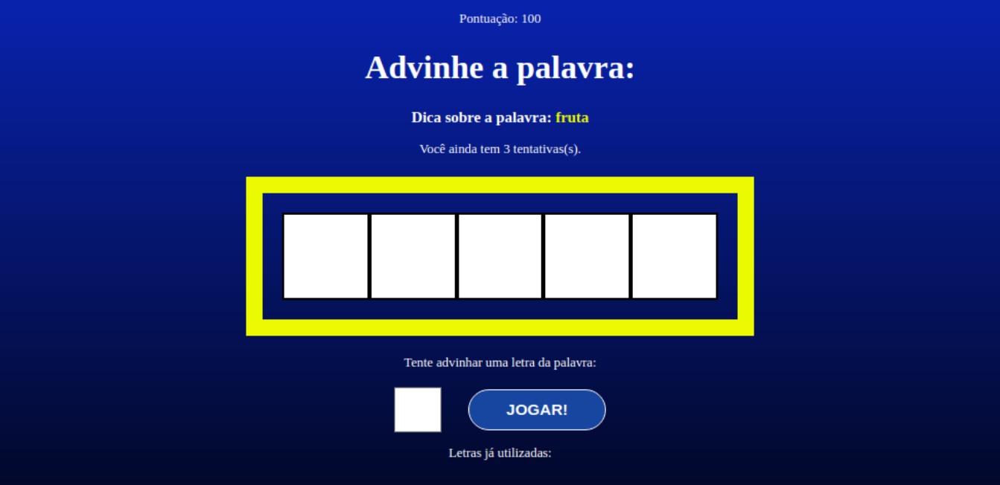

# Secret Word

<!---Esses são exemplos. Veja https://shields.io para outras pessoas ou para personalizar este conjunto de escudos. Você pode querer incluir dependências, status do projeto e
 informações de licença aqui--->


> Um jogo criado em React.Js para adivinhar palavras

### :rocket: Aplication link

Link: https://secret-wordgame.netlify.app/

### 🔧 Ajustes e alterações

✔️ O projeto foi finalizado.

- [x] React.Js;
- [x] Estilização com CSS;
- [x] Rooks: useCallback, useEffect, useState';
- [x] Componentização; 
- [x] JSON Server; 

### 🎮 Como projeto trabalha

O projeto consiste em um jogo de adivinhação de palavras. 
O projeto foi desenvolvido com <i>React.js</i>.


## :closed_book: Necessidades ##

Depois de iniciar :checkered_flag:, você precisa ter o  [Git](https://git-scm.com) e o [Node](https://nodejs.org/en/) instalados.

## :checkered_flag: Iniciar ##

```bash
# Clonar o projeto
$ git clone https://github.com/Thiagooffice/Secret-Word.git
# Acesse
$ cd Secret-Word
# Instalar dependências
$ yarn or npm 
# Rodar o projeto
$ yarn start
# O servidor será inicializado em <http://localhost:3000>
```
